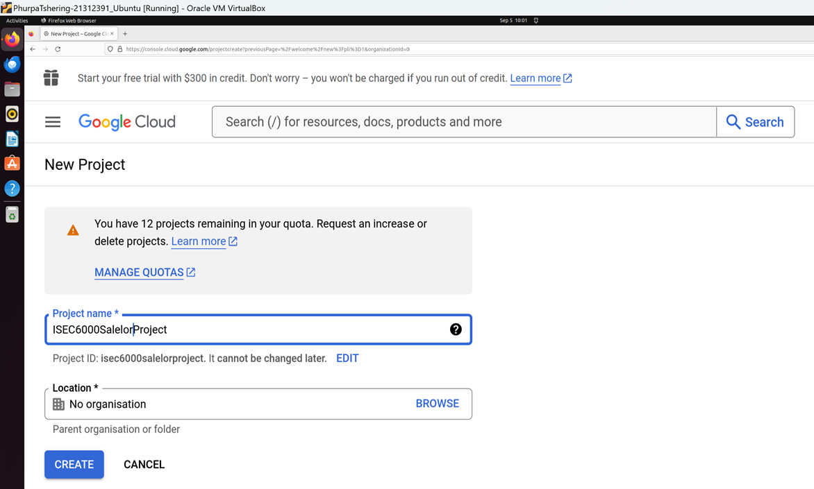
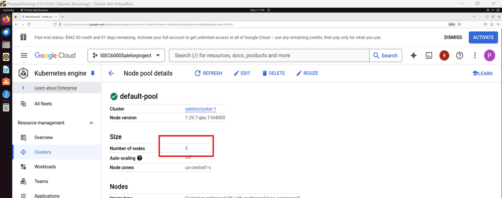
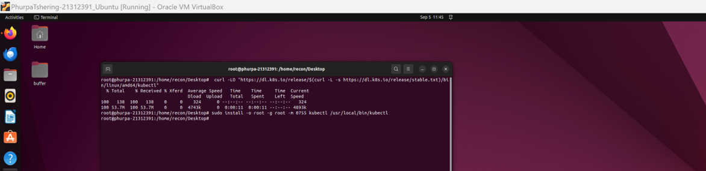
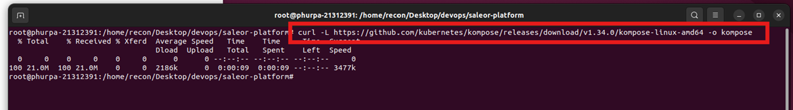
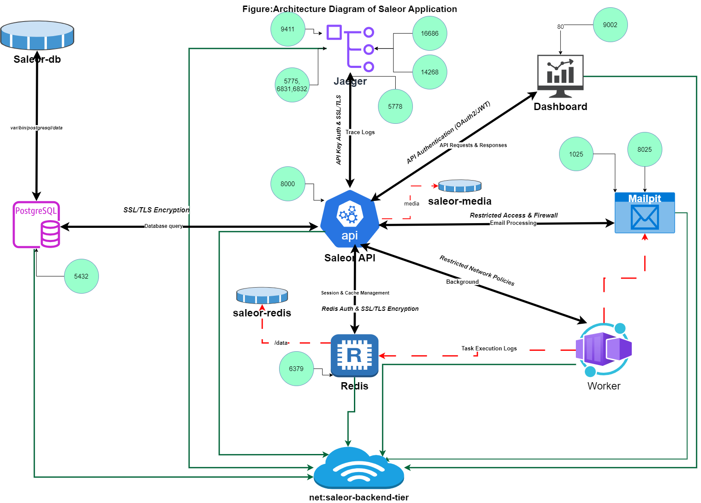

# ISEC6000 Secure DevOps - Assignment 1

## Project Title: Building, Deploying, and Securing a Microservices E-commerce Application

**Author**: Phurpa Tshering  
**Student ID**: 21312391  
**Degree**: MSc Computing (Cybersecurity)  
**University**: Curtin University, Department of Computing Sciences  

---

## Table of Contents
- [Project Overview](#project-overview)
- [Infrastructure Setup](#infrastructure-setup)
- [Microservices Architecture and Deployment](#microservices-architecture-and-deployment)
- [Implementing Security Measures](#implementing-security-measures)
- [Architecture Visualization](#architecture-visualization)
- [Bibliography and References](#bibliography-and-references)

---

## Project Overview

This project demonstrates the deployment and security configuration of a microservices-based e-commerce platform using Saleor. Saleor is a Python-based application featuring a backend API, a React-based frontend (dashboard), PostgreSQL for data persistence, and Redis for caching. The project aims to set up the application infrastructure on Kubernetes, implement security measures, and visualize the overall architecture.

---

## Infrastructure Setup

### 1. Kubernetes Cluster Creation
- Created a Kubernetes cluster on **Google Kubernetes Engine (GKE)**.

- **API enabled** and **Google Cloud Shell** launched to configure the project and zone.
- **Cluster Creation**: Standard cluster with autoscaling enabled. Maximum nodes set to 5.

### 2. Install and Configure `kubectl`
- **Installed kubectl** on the local machine.

- Connected to the GKE cluster using `kubectl`.
- Verified connectivity using deployment commands.

### 3. GitHub Repository Setup
- Set up a public repository: [ISEC6000-SecureDevOps](https://github.com/phurpa123/ISEC6000-SecureDevOps).
- Forked Saleor repositories and set up local cloning for further customization.

---

## Microservices Architecture and Deployment

### 1. Explore Saleor
- Familiarized with the core projects: **Saleor API**, **Saleor Dashboard**, and **Saleor Platform**.
- Forked the Saleor platform and cloned it into the local environment.

### 2. Deployment Process
- Ran `docker-compose up` to start the services.
- Services Deployed:
  - **Saleor API**: Business logic (http://localhost:8000)
  - **Dashboard**: Store management interface (http://localhost:9002)
  - **Jaeger**: Performance monitoring (http://localhost:16686)
  - **Mailpit**: Email handling (http://localhost:8025)
  
### 3. Kubernetes Deployment
- Converted **docker-compose** to Kubernetes resources using **Kompose**.
- Deployed the Saleor application on Kubernetes.

---

## Implementing Security Measures

### 1. Container Security
- **Non-root Users**: Ensured all containers run as non-root users for security.
- **Resource Limits**: Set CPU and memory limits to ensure stability.
  
### 2. Vulnerability Scanning
- Used **Trivy** to scan container images for vulnerabilities.
- Documented scan results and fixed issues by using secure base images.

### 3. SSL/TLS Encryption
- Configured **SSL/TLS** encryption for secure communication between services, including PostgreSQL, Redis, and the API.

### 4. API Authentication
- Implemented **OAuth2/JWT** for API endpoint security between the Dashboard and API.

---

## Architecture Visualization

### Architecture Diagram

### Diagram Annotations:
- **Saleor API**: The central component managing communication between services.
  - Connects to:
    - **PostgreSQL**: For persistent data storage (SSL/TLS on port 5432).
    - **Redis**: For session and cache management (Redis Auth & SSL/TLS on port 6379).
    - **Dashboard**: Via API Auth (OAuth2/JWT on port 9002).
    - **Mailpit**: For email handling with restricted access (ports 8025 and 1025).
    - **Jaeger**: For trace logs (API Key Auth & SSL/TLS).
    - **Worker**: For background tasks (via restricted network policies).

---

## Bibliography and References
- **Saleor Core**: The high-performance headless commerce API ([github.com/saleor/saleor](https://github.com/saleor/saleor)).
- **Dr. Nur Haldar**: *ISEC6000 Secure DevOps Unit Material* – Curtin University, 2024.
- **Kubernetes Documentation**: Install and Set Up `kubectl` on Linux ([kubernetes.io](https://kubernetes.io)).

---

